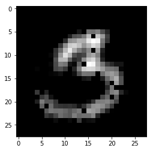
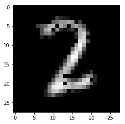
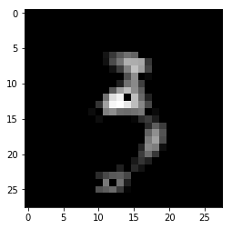
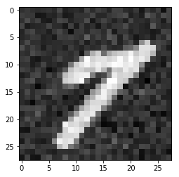
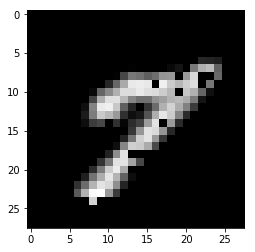
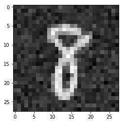
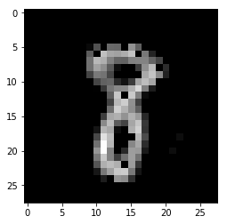

# Autoencoder-Denoiser
### A tensorflow implmentation of image denoiser using autoencder (CNN) structure.

The network consist of an encoder and a decoder. It encodes 2D images into 100 dimemsion embedding and then decodes to reconstruct 2D images. The encoder contains 2 convolutional layers and 1 fully connected layer, and the decoder contains 2 fully connected layer, 2 deconvolutional layers.
The network structure is simple, but very effective. I use mnist dataset as example. The network clearly have learnt how to remove random gaussian noise in less than 3000 iterations(not epochs) of training.

## Examples

### Training Data

Reconstructed training image (3000 iterations)

Reconstructed training image (6000 iterations)

Reconstructed training image (9000 iterations)

### Test data

Noisy image 1

Reconstructed image 1

Noisy image 2

Reconstructed image 2
